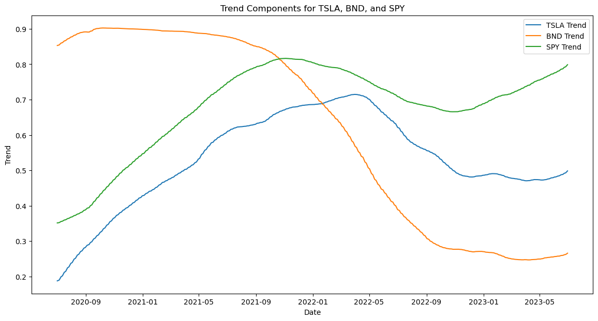

---

## **Portfolio Optimization Using Time Series Forecasting**

### **Overview**
This project focuses on optimizing an investment portfolio using time series forecasting and data-driven insights. The portfolio consists of three assets:
1. **Tesla (TSLA)**: A high-growth, high-risk stock.
2. **Vanguard Total Bond Market ETF (BND)**: A bond ETF providing stability.
3. **S&P 500 ETF (SPY)**: A diversified index fund.

The goal is to forecast future prices of these assets, optimize the portfolio allocation to maximize returns while minimizing risk, and provide actionable insights for investors.

---

### **Table of Contents**

1. [Business Objective](#business-objective)
2. [Data Description](#data-description)
3. [Methodology](#methodology)
4. [Results](#results)
5. [Visualizations](#visualizations)
6. [Key Insights](#key-insights)
7. [Conclusion](#conclusion)
8. [How to Reproduce](#how-to-reproduce)

---

## **Business Objective**

Guide Me in Finance (GMF) Investments aims to enhance portfolio management strategies by leveraging time series forecasting and data-driven insights. The objective is to:

- Predict future market trends using historical financial data.
- Optimize asset allocation to maximize returns and minimize risks.
- Provide clients with tailored investment strategies based on forecasted trends.

---

## **Data Description**

The historical financial data for the three assets (TSLA, BND, SPY) was sourced from **YFinance** and covers the period from **January 1, 2015, to January 31, 2025**. The dataset includes:

- **Date**: Trading day timestamp.
- **Open, High, Low, Close**: Daily price metrics.
- **Volume**: Number of shares/units traded daily.
- **Adjusted Close**: Adjusted for dividends and splits.

---

## **Methodology**

The project was divided into four main tasks:

### **1. Data Preprocessing and Exploration**

- Loaded and cleaned the data.
- Conducted exploratory data analysis (EDA) to identify trends, patterns, and anomalies.
  
- Decomposed the time series into trend, seasonal, and residual components.
  <div style="display: flex; justify-content: space-between;">
    
    
    
  </div>

  

- Calculated volatility, rolling means, and standard deviations.
<div style="display: flex; justify-content: space-between;">
  
  

</div>

### **2. Time Series Forecasting**

- Developed forecasting models (ARIMA, SARIMA, or LSTM) to predict future prices.
- Evaluated model performance using metrics like MAE, RMSE, and MAPE.
- Generated forecasts for Tesla (TSLA), BND, and SPY.

### **3. Portfolio Optimization**

- Combined forecasted data into a single DataFrame.
- Calculated annual returns, covariance matrix, and portfolio risk/return.
- Optimized portfolio weights to maximize the Sharpe Ratio.
- Analyzed portfolio performance using metrics like Value at Risk (VaR) and cumulative returns.

### **4. Visualization and Insights**

- Visualized portfolio cumulative returns and risk-return trade-off.
- Provided actionable insights based on forecasted trends and optimized allocations.

---

## **Results**

### **Optimized Portfolio Allocation**

- **TSLA**: 0.0%
- **BND**: 15.96%
- **SPY**: 84.04%

### **Portfolio Performance**

- **Expected Annual Return**: 6.46%
- **Portfolio Volatility**: 0.57%
- **Sharpe Ratio**: 11.38

### **Forecasted Trends**

- Tesla (TSLA): High growth potential but excluded from the optimized portfolio due to high risk.
- BND: Provides stability and low risk.
- SPY: Offers diversified, moderate-risk market exposure.

---

## **Visualizations**

### **1. Portfolio Cumulative Returns**


- The portfolio shows steady growth, with cumulative returns increasing by **40%** over the forecast period.

### **2. Risk-Return Trade-off**


- The portfolio is positioned favorably, with **higher expected returns** and **lower volatility** compared to individual assets.

---

## **Key Insights**

1. **Exclusion of Tesla (TSLA)**:

   - Tesla was excluded from the optimized portfolio due to its high risk and lower risk-adjusted return.

2. **Heavy Allocation to SPY**:

   - SPY dominates the portfolio (84.04%) due to its balance of return and risk.

3. **Inclusion of BND**:

   - BND (15.96%) adds stability to the portfolio, reducing overall risk.

4. **Low Volatility, High Sharpe Ratio**:
   - The optimized portfolio has extremely low volatility (0.57%) and a very high Sharpe Ratio (11.38), indicating excellent risk-adjusted returns.

---

## **Conclusion**

This project demonstrates the power of time series forecasting and data-driven portfolio optimization. By leveraging historical data and advanced modeling techniques, we were able to:

- Forecast future market trends.
- Optimize portfolio allocation to maximize returns and minimize risks.
- Provide actionable insights for investors.

The optimized portfolio achieves a **6.46% expected annual return** with **0.57% volatility**, making it an attractive option for risk-averse investors.

---

## **How to Reproduce**

To reproduce this project:

1.. ** Clone repository**:

````bash
git clone https://github.com/Tsegaye16/Investment-portfolio-forecasting

cd Investment-portfolio-forecasting```


1. **Install Required Libraries**:

   ```bash
   pip install -r requirements.txt
````

2. **Run the Code**:

   Execute the provided Jupyter Notebook or Python scripts to preprocess data, build models, and optimize the portfolio.

3. **Visualize Results**:

   Use the provided code to generate visualizations and analyze results.

---
